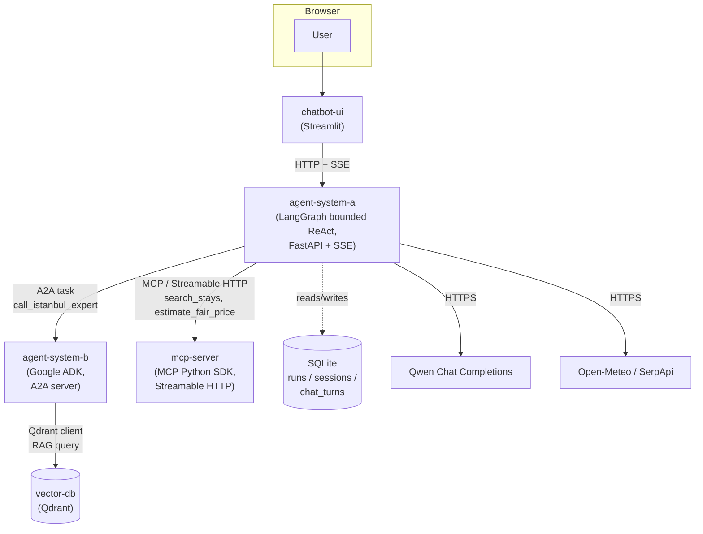

# VoyagerAI Istanbul

A decision-support system for trip planning to Istanbul: ranked flights, ranked stays with an explainable fair-price deal score, a side-aware and ferry-aware day-by-day itinerary, and a post-trip conversational assistant with persistent history — all with full data provenance.

**VoyagerAI Istanbul never books, reserves, or pays for anything.** Every result is explicitly labeled as decision-support information — flight and accommodation data are point-in-time or historical snapshots, never live availability, and no part of the system can execute a purchase, hold a reservation, or submit payment details anywhere.

**Intended user:** a traveler planning one specific trip to Istanbul who wants a ranked, explainable comparison of flights and stays plus a realistic day-by-day plan — not a general-purpose travel chatbot.

**Scope: Istanbul only, Version 1.** `destination` is contract-locked to `IST`; no other city is supported, configured, or claimed.

Full architecture specification: [`docs/architecture.md`](docs/architecture.md) (canonical, converted from `docs/architecture-plan.pdf`). Architecture Decision Records: [`docs/adr/`](docs/adr/). Final evaluation: [`EVALUATION.md`](EVALUATION.md). Five-minute demo script: [`docs/DEMO_SCRIPT.md`](docs/DEMO_SCRIPT.md).

---

## Table of contents

- [Architecture](#architecture)
- [Repository / submodule structure](#repository--submodule-structure)
- [System A — the bounded ReAct planner](#system-a--the-bounded-react-planner)
- [System B — the Istanbul local expert](#system-b--the-istanbul-local-expert)
- [MCP server and tools](#mcp-server-and-tools)
- [Qdrant multilingual RAG](#qdrant-multilingual-rag)
- [Persistence: SQLite runs, sessions, chat, and the sidebar](#persistence-sqlite-runs-sessions-chat-and-the-sidebar)
- [Public API and SSE](#public-api-and-sse)
- [Real vs. historical vs. fixture data](#real-vs-historical-vs-fixture-data)
- [Running it: Docker Compose](#running-it-docker-compose)
- [Required environment variables](#required-environment-variables)
- [Fixture mode vs. real mode](#fixture-mode-vs-real-mode)
- [Manual smoke tests (English and Arabic)](#manual-smoke-tests-english-and-arabic)
- [Automated tests](#automated-tests)
- [Guardrails, timeouts, and degradation](#guardrails-timeouts-and-degradation)
- [Data sources and provider limitations](#data-sources-and-provider-limitations)
- [Known limitations](#known-limitations)
- [Troubleshooting](#troubleshooting)

---

## Architecture

Exactly two independently deployed agent systems on different stacks, one shared MCP tool service, one vector database, and one frontend — five long-running containers, communicating only over the connections shown below.



**Network boundaries, exactly as implemented** (not as originally proposed — see [Known limitations](#known-limitations)):

- `chatbot-ui` talks **only** to `agent-system-a`, over HTTP/SSE. It never calls a provider, Travel MCP, Qdrant, or System B directly, and holds no provider credential.
- `agent-system-a` → `mcp-server`: **MCP over Streamable HTTP**, used only for the two accommodation tools (`search_stays`, `estimate_fair_price`). This is the *only* MCP boundary in the system.
- `agent-system-a` → `agent-system-b`: **A2A** (Agent-to-Agent, real network protocol, official A2A SDK client/executor), used only for `call_istanbul_expert`. A2A is never used between LangGraph nodes or for any other call.
- `agent-system-b` → `vector-db`: a direct Qdrant client call (RAG query). `agent-system-b` never calls `mcp-server` — despite the original proposal's diagram showing that edge, the implemented System B has no MCP dependency at all (confirmed: no MCP env var, no MCP import, `depends_on: vector-db` only in `docker-compose.yml`).
- `agent-system-a` also calls three **root-owned provider adapters directly** (not through MCP): Open-Meteo (weather), SerpApi (web evidence, Google Flights). These are HTTPS calls from `orchestration/`-composed adapters, not MCP tools.
- `mcp-server` never depends on `vector-db` — it owns dynamic shared travel tools (accommodation search/pricing), never RAG retrieval.

## Repository / submodule structure

This root repository is an **orchestrator**. Each `services/*` directory is an independent git submodule with its own remote and commit history — a change inside a submodule and the corresponding gitlink bump here are always two separate commits in two separate repositories.

| Path | Role | Stack |
|---|---|---|
| `services/planner-a` | System A — bounded ReAct trip planner | LangGraph, FastAPI, SSE |
| `services/istanbul-expert-b` | System B — Istanbul local expert | Google ADK, FastAPI, A2A |
| `services/travel-mcp` | Shared accommodation MCP server | Official MCP Python SDK, Streamable HTTP |
| `services/frontend` | Chat UI | Streamlit |
| `orchestration/` | Root-owned composition layer: the public System A HTTP/SSE API, SQLite persistence, real tool/provider wiring | Python, FastAPI |
| `providers/` | Root-owned real provider adapters (weather, web evidence, flights, FX) | Python |
| `rag/` | Root-owned RAG ingestion/corpus pipeline (Qdrant population) | Python |
| *(no submodule)* | `vector-db` — managed Qdrant image | Qdrant |

## System A — the bounded ReAct planner

`services/planner-a` implements a **bounded LangGraph ReAct loop**, composed into the real system by root-owned `orchestration/system_a/`.

**Supervisor / specialist split:** the supervisor graph owns delegation, the A2A call to System B, and final synthesis. It cannot call any of the five travel-search tools directly. A single internal, compiled **Travel Search specialist** sub-graph (a genuine separate `StateGraph`, not a second service) owns `get_weather`, `web_search`, `search_flights`, `search_stays`, and `estimate_fair_price`, invoked by the supervisor via one delegation action (`call_travel_search`).

**Closed action allowlist** — the only actions a decision provider (Qwen, or a fixture) may ever produce:

| Supervisor-only | Specialist-only |
|---|---|
| `call_istanbul_expert`, `call_travel_search`, `ask_clarification`, `synthesize`, `degrade` | `get_weather`, `web_search`, `search_flights`, `search_stays`, `estimate_fair_price`, `travel_search_complete` |

Every action's arguments are validated against a closed, `extra="forbid"` Pydantic schema — an unknown tool name, an arbitrary URL, or a booking/payment-shaped action is a validation error before it ever reaches execution.

**Bounds enforced in code, not just prompts** (`phase4/models.py`): `MAX_GRAPH_TRANSITIONS=25` (supervisor recursion limit), `MAX_SPECIALIST_GRAPH_TRANSITIONS=15`, `MAX_EXTERNAL_TOOL_CALLS=8` (shared budget across both graphs), `MAX_SPECIALIST_EXTERNAL_CALLS=5`, `MAX_CALLS_PER_TOOL=2`, `MAX_DECISION_REPAIRS=2` / `MAX_SPECIALIST_DECISION_REPAIRS=2`, `TOTAL_WORKFLOW_DEADLINE_SECONDS=60.0`.

**Post-trip chat**: once a run completes, a separate chat-turn contract (`phase4/chat_*.py`, composed by `orchestration/system_a/chat_service.py`) answers follow-up questions, applies validated trip modifications (closed patch-field allowlist), and never lets the model construct an MCP/A2A call directly — a validated patch is handed to the same, unmodified planning pipeline as an ordinary new run.

## System B — the Istanbul local expert

`services/istanbul-expert-b` is a **Google ADK** agent, exposed as a genuine FastAPI app with the official **A2A** app mounted at `/`. It builds a side-aware (European/Asian), ferry-aware, multi-day itinerary from a candidate pool of points of interest.

**RAG-first candidate selection**: for every supported interest (attractions, culture, history, food, shopping, nightlife, nature, islands, family, accessibility, religious heritage, photography, neighborhoods, transportation, etiquette, seasonal planning — a closed vocabulary), Qdrant retrieval is the **first-priority** candidate source. A catalog fallback is used only when RAG evidence is insufficient for a given interest, and every scheduled point of interest carries a `candidate_provenance` entry recording whether it came from `rag` or `catalog_fallback`, plus (for RAG-origin candidates) the source document, chunk, retrieval query, and retrieval score. See [Qdrant multilingual RAG](#qdrant-multilingual-rag) for the measured RAG-origin rate.

System B degrades to catalog-only scheduling, with an explicit warning, whenever Qdrant is unreachable or returns no usable evidence for a requested interest — it never claims RAG grounding it doesn't have, and never invents a POI or citation.

## MCP server and tools

`services/travel-mcp` is the one shared MCP server in this system, exposed over **Streamable HTTP** (official MCP Python SDK). It owns exactly two tools, both backed by a single pinned historical Inside Airbnb Istanbul snapshot — **never live availability, never a live price, never a booking**:

| Tool | Provides |
|---|---|
| `search_stays` | Ranked stay candidates from the frozen snapshot, filtered by dates/guests/district/side/room type/amenities/budget, ranked by a deterministic preliminary price-value score. |
| `estimate_fair_price` | The same fair-price/deal-score estimate `search_stays` computes, looked up for one existing `stay_id` from the same snapshot. Rejects an unknown `stay_id` (`STAY_NOT_FOUND`) or an unsupported room type. |

Weather (Open-Meteo), web evidence and flight search (SerpApi) are **not** MCP tools — they are root-owned `providers/` adapters that `agent-system-a` calls directly over HTTPS.

## Qdrant multilingual RAG

**Corpus**: real, stable Wikipedia content in English/Turkish/Arabic (CC BY-SA 4.0) plus a small number of official/primary sources, fetched via `rag/corpus_sources.py`. The active demo collection (`istanbul_rag_B_r1_shadow`, the collection `agent-system-b` is actually configured to read — see `docker-compose.yml`'s `QDRANT_COLLECTION_NAME`) holds 69 source documents (39 EN / 14 TR / 16 AR) across 17 interest facets, chunked into **287 document-chunk points plus one fingerprint-marker point = 288 Qdrant points total**. A separate, frozen, untouched collection (`istanbul_rag_B`, 91 points, the original 20-document Phase 3 corpus) coexists in the same Qdrant instance and is never mutated by demo operation, but is **not** the collection the running demo actually queries.

**Chunking / embedding / retrieval** (frozen contract, `rag/ingest.py`): embedding model `intfloat/multilingual-e5-small` (384-dim, dense). Four chunk/top-K configurations were compared (350 or 700 tokens, 50 or 100 token overlap, top-3 or top-5); **config B (350 tokens / 50 overlap / top-5)** was selected by measured Recall@5 (see [`EVALUATION.md`](EVALUATION.md) for the full comparison, including dense vs. dense+sparse hybrid retrieval, which dense retrieval won).

**RAG-first vs. catalog fallback (measured, `evaluation/datasets/istanbul_expert_r1_summary_report.json`):** across 8 demonstration cases (EN, TR, AR, and accessibility-focused requests), **24 of 27** scheduled points of interest (88.9%) originated from RAG evidence, meeting the project's own 80% RAG-origin target; the remaining 3 came from catalog fallback. A separate Qdrant-unavailable demo confirmed clean, honest degradation: 4/4 candidates fell back to the catalog, with explicit warnings (`candidate_pool_no_rag_candidates_catalog_fallback_used`, `rag_unavailable_structured_catalog_only`) and no fabricated RAG evidence.

Ingestion is a real, idempotent one-shot Compose service (`rag-ingest`, `profiles: ["ingest"]`) — it never runs as part of a bare `docker compose up` and must be run explicitly. **Disclosed reproducibility gap:** `rag-ingest bootstrap`/`status`/`ingest` only ever populate `istanbul_rag_B` (`rag/ingest.py::collection_name()` derives the name deterministically from the chunk config — `"B"` → `"istanbul_rag_B"` — with no parameter capable of producing `istanbul_rag_B_r1_shadow`, and its corpus source is `rag/documents/*.json`, the original 20-document set, not the 69-document expansion in `rag/corpus_sources.py`). There is currently **no supported, repository-provided command that creates or populates `istanbul_rag_B_r1_shadow` on a fresh Qdrant volume** — this repository was searched exhaustively (`rag/ingest_cli.py`, `rag/ingest.py`, `rag/build_documents.py`, every script under `rag/`) and no such command exists. The demo's active collection was populated during development through a process not captured as a reusable, documented command. A fresh clone that runs only the commands in this README will have a populated `istanbul_rag_B` and an **empty** `istanbul_rag_B_r1_shadow`; System B will degrade to catalog-only scheduling (with an explicit warning) until this gap is closed by a future, production-code change — not attempted here, since this is a documentation-only note, not a fix.

## Persistence: SQLite runs, sessions, chat, and the sidebar

System A owns one SQLite database (`orchestration/system_a/run_store.py`, WAL mode, bounded busy-timeout), persisted on the `agent_system_a_data` named Docker volume:

- **`runs`** — one row per planning run: status, the original request (including the submitted `TripRequest`), the final result once terminal, idempotency key.
- **`run_events`** — the ordered, sanitized SSE progress log per run, enabling reconnect/replay via `Last-Event-ID`.
- **`chat_turns`** — the full post-trip conversation transcript, one row per message, scoped by `session_id` (not by run — a chat-triggered replan keeps the same session, new run). Never stores a credential, system prompt, raw model response, or raw provider payload; a provider failure is recorded as `provider_failed` and explicitly excluded from future model context (`include_in_context=false`).

**The recent-session sidebar** (`chatbot-ui`) lists every session that has ever had a run, grouped by `session_id`, sorted by most-recently-updated first, with a deterministic (never LLM-generated) title such as `BEY → Istanbul · 19–23 Sep`. Selecting a session restores its authoritative run and full transcript without creating a new run; a chat-triggered modification always keeps the same session ID and updates that session's sidebar entry to the new run.

## Public API and SSE

All routes are served by `agent-system-a` (`orchestration/system_a/api.py`), published to the host at `http://localhost:8002`. Every request/response contract is a closed, `extra="forbid"` Pydantic model; every error uses one shared envelope (`schema_version`, `error_code`, `message`, `trace_id`, `retriable`) — no stack trace, file path, credential, or raw provider body ever reaches a caller.

| Method | Path | Purpose |
|---|---|---|
| `GET` | `/health` | Liveness + non-secret `mode` (`real`/`fixture`). |
| `POST` | `/v1/runs` | Create a planning run (`user_message`, optional structured `trip_request`, optional `idempotency_key`). |
| `GET` | `/v1/runs/{run_id}` | Run status, terminal result, and the originally-submitted `trip_request`. |
| `POST` | `/v1/runs/{run_id}/cancel` | Request cooperative cancellation. |
| `GET` | `/v1/runs/{run_id}/events` | Server-Sent Events progress stream, resumable via `Last-Event-ID`. |
| `POST` | `/v1/chat/turns` | One post-trip chat turn: explain, modify, regenerate, clarify, or reset. |
| `GET` | `/v1/chat/sessions/{session_id}/turns` | Full persisted transcript for one session (ownership-checked against `run_id`). |
| `GET` | `/v1/chat/sessions` | Bounded recent-session listing for the sidebar (`limit` ≤ 50, `offset`). |

SSE stages include the original linear-pipeline vocabulary plus the ReAct action-loop's own additive stages: `run_started`, `action_started`, `action_completed`, `action_failed`, `run_completed`, `run_degraded`, `run_failed`, `run_cancelled`.

## Real vs. historical vs. fixture data

- **Real / live**: Qwen decision calls, Open-Meteo weather, SerpApi web evidence and Google Flights, the real A2A round trip to System B, real Qdrant retrieval — all genuine network calls in `real` mode.
- **Historical / cached**: accommodation search results (`search_stays`/`estimate_fair_price`) are always drawn from one pinned historical Inside Airbnb snapshot with an explicit `snapshot_date` — never live availability, regardless of mode.
- **Fixture**: `VOYAGER_SYSTEM_A_MODE=fixture` (the Compose default) swaps in deterministic, network-free tool executors and decision providers — zero paid-provider calls, explicitly labeled via `/health`'s `mode` field and a frontend banner.

## Running it: Docker Compose

Requires Docker and Docker Compose. From the repository root:

```bash
docker compose up -d
```

This starts all five services in **fixture mode by default** (no `.env` file needed, zero paid-provider calls).

```bash
docker compose run --rm rag-ingest bootstrap
```

populates the frozen `istanbul_rag_B` collection — real, useful for the original Phase 3 corpus, but **not** the collection System B is actually configured to read in this demo (`istanbul_rag_B_r1_shadow`; see [Qdrant multilingual RAG](#qdrant-multilingual-rag) for the disclosed gap: no repository command currently populates that collection on a fresh volume). On a genuinely fresh `vector-db` volume, System B degrades to catalog-only scheduling with an explicit warning until this is resolved.

Verify every container is healthy:

```bash
docker compose ps
```

All five (`agent-system-a`, `agent-system-b`, `mcp-server`, `vector-db`, `chatbot-ui`) should report `healthy`. Open the UI at `http://localhost:8501`; the public API is at `http://localhost:8002`.

Stop everything (preserves the named volumes — run/session/chat history and Qdrant data survive):

```bash
docker compose down
```

## Required environment variables

Copy `.env.example` to `.env` and fill in real values only for what you need — every variable has a safe default and the stack starts with no `.env` at all (fixture mode, zero paid calls). Full reference: [`.env.example`](.env.example).

| Variable | Needed for |
|---|---|
| `VOYAGER_SYSTEM_A_MODE` | `real` to enable live providers (default under Compose: `fixture`). |
| `QWEN_API_KEY` / `QWEN_BASE_URL` (or `DASHSCOPE_API_KEY`) | Real routing/chat decisions. |
| `SERPAPI_API_KEY` | Real web evidence and Google Flights search. |
| `QDRANT_URL` | Overriding System B's Qdrant target (defaults to the internal Compose service). |
| `AGENT_SYSTEM_A_BASE_URL` | Only needed running `chatbot-ui` standalone outside Compose. |
| `TRAVEL_MCP_BASE_URL` / `ISTANBUL_EXPERT_A2A_BASE_URL` | Only needed running `agent-system-a` standalone outside Compose. |

No variable in this project is required for the default fixture-mode demo to run.

## Fixture mode vs. real mode

- **Fixture** (`VOYAGER_SYSTEM_A_MODE=fixture`, the Compose default): deterministic `FakeToolExecutor` and rule-based `SupervisorFixtureDecisionProvider`/`SpecialistFixtureDecisionProvider`/`ChatFixtureDecisionProvider` — no network call, ever. Good for demoing the dashboard, sidebar, and UI flow with zero cost and zero external dependency.
- **Real** (`VOYAGER_SYSTEM_A_MODE=real`, requires `QWEN_API_KEY`/`QWEN_BASE_URL`, `SERPAPI_API_KEY`): the genuine bounded ReAct loop, real Qwen decisions, real weather/flights/web evidence, real A2A call to System B, real Qdrant retrieval.

Switch by setting `VOYAGER_SYSTEM_A_MODE=real` in `.env`, then:

```bash
docker compose up -d --no-deps --force-recreate agent-system-a
```

## Manual smoke tests (English and Arabic)

With the stack running in **real** mode and a trip already planned:

**English**
1. `What is my budget?` → a deterministic answer stating the exact stored amount and currency, no new run.
2. `Change my budget to 50000 TRY` → a validated budget patch (explicit amount and currency, correct minor-unit conversion), exactly one new run, same session.
3. `Why did you recommend Chora Church?` → the explanation is generated by Qwen but constrained to the completed run's itinerary and retrieved source evidence; it does not launch a new travel search, MCP call, or A2A planning request, and no new run is created. (If Chora Church is not one of the points of interest this particular run actually scheduled, ask about whichever point of interest the dashboard *did* display instead.)
4. `Which sources support this recommendation?` → a follow-up explanation grounded only in this run's own citations, no new run, no fabricated source.

**Arabic**
1. `ما هي ميزانيتي؟` → a meaningful Arabic answer with the correct amount and currency.
2. `غيّر ميزانيتي إلى 1800 دولار` → a validated USD patch, exactly one new run, same session, Arabic acknowledgement.
3. `ما هي المصادر التي تدعم هذه التوصية؟` → a grounded Arabic explanation citing real evidence, no new run.

## Automated tests

Each command is run from the directory shown; `--import-mode=importlib` avoids a same-basename test-module collision across sibling packages.

```bash
# Root-owned orchestration (System A API, persistence, chat, sessions)
python -m pytest orchestration/ -q --import-mode=importlib

# Root providers / RAG / contracts
python -m pytest providers/ rag/ contracts/ -q --import-mode=importlib

# System A planner (LangGraph, chat contract)
cd services/planner-a && python -m pytest -q --import-mode=importlib

# System B (Google ADK, A2A, RAG integration)
cd services/istanbul-expert-b && python -m pytest -q --import-mode=importlib

# Travel MCP (accommodation search, fair-price, ML)
cd services/travel-mcp && python -m pytest -q --import-mode=importlib

# Frontend (Streamlit chat UI + sidebar)
cd services/frontend && python -m pytest phase6/tests/ -q --import-mode=importlib
```

## Guardrails, timeouts, and degradation

- **Input guard**: deterministic, regex/allowlist-based prompt-injection and malformed-input detection (`phase4/guards.py`) runs before any run is created and before any provider is called.
- **Output guard**: every result is scanned for booking/payment-confirmation-shaped language before being returned; the system structurally cannot claim a reservation exists.
- **Bounded everything**: recursion limits, external-tool-call budgets, per-tool call caps, decision-repair budgets, and a 60-second total workflow deadline are enforced in code (see [System A](#system-a--the-bounded-react-planner)) — a model proposing an out-of-bound or out-of-role action is rejected by validation, never executed.
- **Provider-error boundary**: a permanent provider failure (bad credentials, quota) is surfaced honestly as `503 PROVIDER_UNAVAILABLE`; a transient failure (timeout, rate limit) gets one bounded retry before the same honest failure — never silently reclassified as user ambiguity.
- **No internal detail ever reaches a caller**: exceptions are logged server-side keyed by `trace_id`; every HTTP error response is the closed envelope shape only.

## Data sources and provider limitations

- **Accommodation**: one pinned historical Inside Airbnb Istanbul snapshot — real listings, but never live availability or a live price. Hotel-room and shared-room listings are unsupported by the V1 serving contract.
- **Weather**: Open-Meteo — real live forecast within its own forecast horizon; a trip date beyond that horizon receives historical climate guidance instead, explicitly labeled as such, never presented as a forecast.
- **Flights**: SerpApi Google Flights — real, one-way, exact-date search only; no round-trip, multi-city, or booking capability exists.
- **Web evidence**: SerpApi Google Search — real organic-result evidence with deterministic host-based source classification.
- **RAG knowledge**: stable, encyclopedic content (Wikipedia + a small number of official sources) — never used for live/dynamic facts (those always go through a live provider, never retrieval).

## Known limitations

- The original architecture proposal's diagram showed `agent-system-b` also connecting to `mcp-server`; the implemented system does not use this edge — System B only ever queries Qdrant directly. This README documents the implemented wiring, not the original proposal.
- The monetary trip budget is validated, persisted, displayed, passed into relevant searches, and used by the budget summary. The current bounded-ReAct implementation does not include the proposal's full deterministic total-trip feasibility and iterative budget-repair engine (`architecture.md` §12), so it does not guarantee that every combined flight/stay/itinerary result fits the requested monetary budget. The eight-call external-tool budget is an orchestration safety bound and is unrelated to the traveler's monetary budget.
- Session continuation has no dedicated "continue" REST endpoint — multi-turn continuation is proven at the LangGraph-checkpoint level and, separately, through the post-trip chat contract, not as a single unified mechanism.
- Live-Qwen supervisor routing accuracy required two rounds of prompt remediation before clearing its required threshold; the final, passing measurement and the two preceding blocked attempts are both reported, unedited, in [`EVALUATION.md`](EVALUATION.md).
- The RAG generation-faithfulness acceptance gate has one unresolved, disclosed failure (a judge-context false negative on a single case) — see [`EVALUATION.md`](EVALUATION.md) for the full, un-hidden result.
- This is a local, single-user demo. The recent-session sidebar has no per-user ownership boundary — any browser session can list and switch into any session in the database. A production, multi-user deployment would require adding authenticated session ownership before exposing this sidebar beyond a trusted local demo.

## Troubleshooting

**Qwen returns 403 / quota exceeded.** In real mode, a permanent provider failure now returns an honest `503 PROVIDER_UNAVAILABLE` (chat) or a degraded run (planning) — it is never silently reported as "I couldn't understand that." Check `QWEN_API_KEY`/`DASHSCOPE_API_KEY` and account quota/billing status; a transient rate limit resolves itself on retry.

**A run comes back `degraded` instead of `completed`.** This is honest, correct behavior when one provider failed or returned nothing usable — check the run's `warnings` list in the dashboard for which capability degraded and why. It is never silently hidden.

**System B is slow to become healthy on first boot.** The first `docker compose up` with `QDRANT_URL` set (the Compose default) triggers a real, internet-dependent, multi-minute embedding-model cold start inside `agent-system-b`. Subsequent starts reuse the cached model on the `agent_system_b_data` volume. To skip this entirely for an offline demo, set `QDRANT_URL=` (empty) in `.env`.

**No flight or weather results appear.** Check that `VOYAGER_SYSTEM_A_MODE=real` and `SERPAPI_API_KEY`/`QWEN_API_KEY` are actually set — in fixture mode, results are deterministic fixture data, not a missing-result bug. In real mode, a trip date far beyond Open-Meteo's forecast horizon correctly falls back to historical climate guidance instead of a forecast; a flight search with no live inventory for the requested route/date is reported as a real, empty result, never fabricated.

**Qdrant collection appears empty / System B shows no citations.** `docker compose run --rm rag-ingest bootstrap` populates `istanbul_rag_B`, not the `istanbul_rag_B_r1_shadow` collection this demo actually reads — see the disclosed gap in [Qdrant multilingual RAG](#qdrant-multilingual-rag). On the environment this system was developed and demonstrated in, `istanbul_rag_B_r1_shadow` is already populated on the persistent `qdrant_storage` volume; if that volume is genuinely fresh, System B correctly degrades to catalog-only scheduling (with an explicit warning) rather than failing or fabricating evidence.
